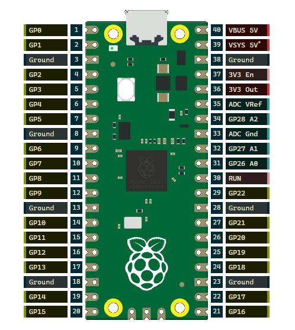

# Digitální vstupy a výstupy
- |[Raspberry Pi Pico GPIO Pinout](https://pico.pinout.xyz/)| |
  |---|---|
  |  | Raspberry Pi Pico má celkem 26 GPIO pinů (plus vestavěnou led na klasickém RPi Pico na GP25, na Pico W na `"LED"`), z nichž všechny lze použít jako digitální vstupy či výstupy. 3 z nich (GP26-28) jsou ovšem vyhrazeny primárně jako analogové a  je lepší využívat GP0-22. Na jakýkoliv pin je možno nastavit **interrupt**, nebo s nimi nechat pracovat PIO.|
- ## Základy práce s piny
	- ### Úvod
		- O práci s digitálním IO se stará třída `Pin` z modulu `machine` Její import provedeme následovně:
		- ```python
		  from machine import Pin	# Import GPIO functions
		  ```
		- Dále pokračujeme konstrukcí objektu třídy `Pin`, který bude reprezentovat náš výstup. Ke konstrukci tohoto objektu potřebujeme následující:
			- **Číslo GPIO pinu (např. `15` -> GP15)**
			- **Nastavení vstup/výstup (`Pin.IN` -> vstup, `Pin.OUT` pro výstup)**
			- Nastavení Pull-Up nebo Pull-Down (`Pin.PULL_UP` nebo `Pin.PULL_DOWN`)
			- > Tučně jsou zvýrazněny povinné položky
		- A výsledný konstruktor vypadá např: takto:
		- ```python
		  led = Pin(25, Pin.OUT)	# Attach builtin led to GPIO pin 25 (on Pico W use "LED")
		  ```
		- Nyní můžeme výstup ovládat pomocí řídících funkcí
		- #### Pro výstupy
			- `led.on()` a `led.high()` nastaví pin na log. 1
			- `led.off()` a `led.low()` nastaví pin na log. 0
			- `led.value(x)` nastaví pin na hod. proměnné x (0 nebo 1)
		- #### Pro vstupy
			- `led.value()` vrátí přečtenou log. hodnotu na pinu
	- ### Jednoduchý příklad
		- Napíšeme si program který při stisku tlačítka přepne stav interní LED
		- ```python
		  from machine import Pin				# Import GPIO functions
		  
		  led = Pin(25, Pin.OUT)				# Attach led to GP25
		  btn = Pin(2, Pin.IN, Pin.PULL_UP)	# Attach btn to GP2, use pull-up (btn connected between pin 2 and ground)
		  
		  while True:
		    if btn.value() == 0:					# If button is pressed, toggle the led
		      led.toggle()						# Warning - toggle() works only on Pico boards!
		      while btn.value() == 0:				# Wait until button is released
		        pass
		  ```