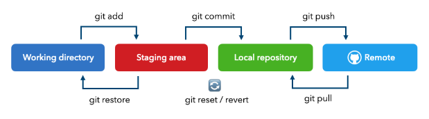

- **# 24. Verzovací systém Git**
	- Created: October 14, 2024 8:25 AM
	- Tags: Done
	- Kdo vypracoval: Luky
- ### Co je to Git
	- *Git je distribuovaný systém pro správu verzí, který umožňuje efektivní sledování a správu změn v projektech.*
	- **Umožňuje** jednotlivcům i týmům **pracovat na stejném projektu** → uchovává historii  jednotlivých    změn a umožňuje i návrat k předchozím verzím.
	- Změny jsou uchovávny do tzv. “*commitů”* (záznam změn projektu v daném okamžiku → verze)
- ---
- ### Historie a původ
	- Git byl původně vytvořen pro práci na operačním systému Linux.
	- Autorem Gitu je Linus Torvalds, známý především jako zakladatel Linuxu. Hlavním důvodem jeho vzniku byla potřeba nahradit dřívější systém BitKeeper, který byl zpoplatněn.
	- Od svého uvedení v roce 2005 se Git stal nejrozšířenějším nástrojem pro správu verzí a je používán celosvětově.
- ---
- ### Vlastnosti Gitu
	- **Výhody gitu:**
		- 1. **Distribovanost:** Každý uživatel má vlastní verzi projektu, na které pracuje (možnost nezávislé práce)
		- 2. **Práce offline:** Uživatelé mohou provádět změny i bez připojení k internetu.
		- 3. **Větvení projektu:**
			- Umožňuje jednotlivcům i týmům pracovat na stejném projektu na specifické části bez narušování jiných částí projektu
			- Provedené změny jsou tedy nejdříve jen lokální, aby někdo z vývojářů např. nemohl stáhnout špatnou verzi s chybami nebo nedodělanou atd.
			- Snadno lze vrátit projekt do předchozího stavu (z jakékoliv z předchozích verzí)
		- 4. **Bezpečnost dat:**
			- Data jsou ukládána na server, což chrání projekt před ztrátou způsobenou například chybami disku.
			- Po nahrání na server však autor ztrácí kontrolu nad tím, kdo a v jaké verzi si projekt stáhne.
		- 5. **Sledování změn:** Umožňuje detailně sledovat, kdo provedl jaké změny a kdy k nim došlo.
- ---
- ### Klíčové pojmy
	- **Repozitář (repo):**
	- Místo, kde jsou uloženy všechny soubory projektu, historie změn a další informace.
	- Každý soubor je uložen pouze jednou a poté jako snapshot. Soubory jsou ukládány binárně.
	- **Commit:**
		- “Snímek” (verze) projektu v určitém okamžiku.
		- Umožňuje snadný návrat k dřívějším verzím projektu.
- **4 pracovní prostory:**
	- 1. **Pracovní složka:** Zde probíhají naše změny a úpravy souborů, ale bez promítnutí do repozitáře.
	- 2. **Staging area:** Mezi prostor pro formátování a kontrolu vybraných souborů před comitem.
	- 3. **Lokální repozitář: “**Commitunté” změny, které se projeví jen v repozitáři u nás na disku.
	- 4. **Vzdálený repozitář:** Serverový repozitář. Nahráním změn na server umožní práci stáhnou i na jiné zařízení a pokračovat tam, nebo tím zpřístupníme změny i spolupracovníkům.
	- 
- ---
- ## Základní příkazy a práce s gitem
	- Git ovládáme přes příkazový řádek (shell) použitím následujících příkazů
	- ### Hlavní příkazy Gitu a Shellu
	- **Navigace v cmd:**
		- Přepnutí na disk: `d:`
		- Přechod do složky: `cd "složka"`
		- Návrat o složku výše: `cd ..`
	- **Vytvoření repozitáře:**
		- Lokální: `git init`
		- Na GitHubu: Vytvoření repozitáře s hlavní větví `main`.
	- **Práce s projektem**
		- `git init`: Vytvoření nového repozitáře.
		- `git add`: Přidání souborů do staging area.
		- `git status`: Zobrazení aktuálního stavu repozitáře.
		- `git commit -m "popis"`: Vytvoření nového commitu.
		- `git log`: Výpis historie commitů.
		- `git show`: Zobrazení změn v konkrétním commitu.
		- `git rm`: Odstranění souboru z Gitu.
		- `git branch`: Zobrazení seznamu větví.
		- `git checkout`: Přepnutí mezi větvemi nebo commity.
		- `git switch`: Návrat na konec větve.
		- `git reset`: Návrat repozitáře k určitému commitu, odstranění pozdějších změn.
		- `git clone <url>`: Klonování repozitáře z internetu.
		- `git push`: Nahrání změn na vzdálený server.
		- `git pull`: Stažení změn z vzdáleného repozitáře.
		- `git fetch`: Porovnání místního a vzdáleného stavu repozitáře.`
		- `git merge`: Sloučení dvou větví projektu.
- ---
- ### **Konflikty a řešení (merge)**
	- **Automatické slučování:** Git sloučí větve, pokud se změny nevyskytují ve stejných místech souboru.
	- **Řešení konfliktů:** Pokud dojde k rozporu, Git zobrazí obě verze a uživatel rozhodne, jak konflikt vyřešit.
	- **Git fetch:** Porovná lokální a vzdálený repozitář a ukáže, co je jinak.
	- **Slučování větví:** Ke slučování používáme příkaz `git merge`.
	- **Chování Gitu při změnách:**
		- Git považuje za změnu, pokud se liší text mezi dvěma shodnými částmi.
		- Při konfliktu zobrazí obě verze k porovnání.
		- Snaží se nic nezměnit bez potvrzení uživatele, aby minimalizoval ztrátu dat.
- ---
- ## Issues
	- Umožňují vytvářet úkoly nebo problémy (issues) spojené s projektem
	- Lze přidat podrobný popis problému nebo návrhu na jiné řešení
	- Funguje to jako “diskusní fórum”, kde členové, kteří byli na Issue přiřazeni, mohou dané téma komentovat
	- Issues lze seskupit pod milníky, což umožňuje sledovat postup
- ### **Jak začít s GitHub Issues?**
	- 1. Přejděte na stránku svého repozitáře a klikněte na kartu **"Issues"**.
	- 2. Klikněte na tlačítko **"New issue"** a vyplňte formulář pro vytvoření nového problému.
	- 3. Přidejte stručný popis, přiřaďte štítky nebo uživatele, a případně nastavte milník.
	- Např. při reklamování známky z dílčího vypracování napíšete, že je jedná o reklamaci známky, do popisu popíšete to co jste dodělali/opravili a nejlépe přidáte odkazy (pro jednodušší dohledání). A nakonec označíte učitele, kterých se reklamace týká a k Issue je přiřadíte.
- ---
	- https://naucme.it/chapter/qa-08, https://git-scm.com/, https://cs.wikipedia.org/wiki/Git